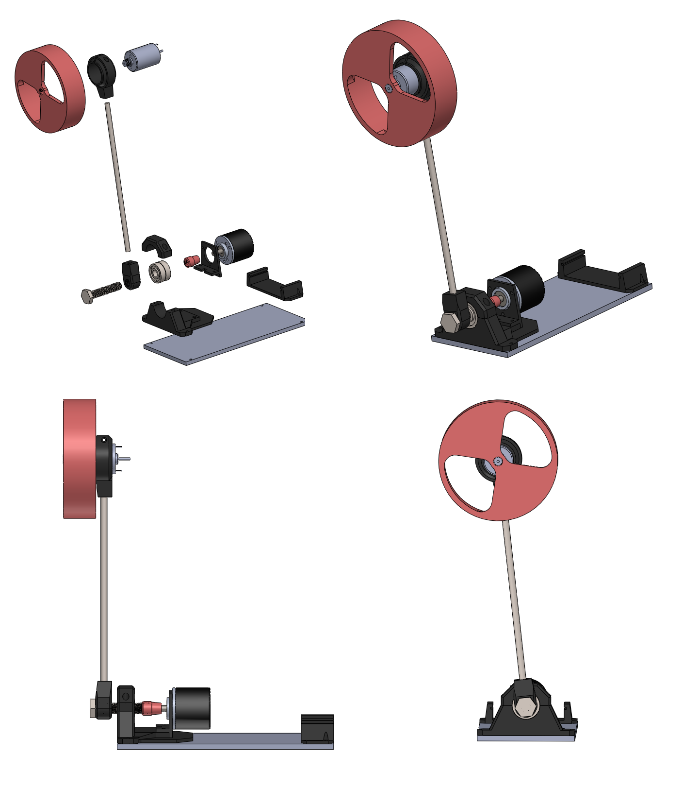
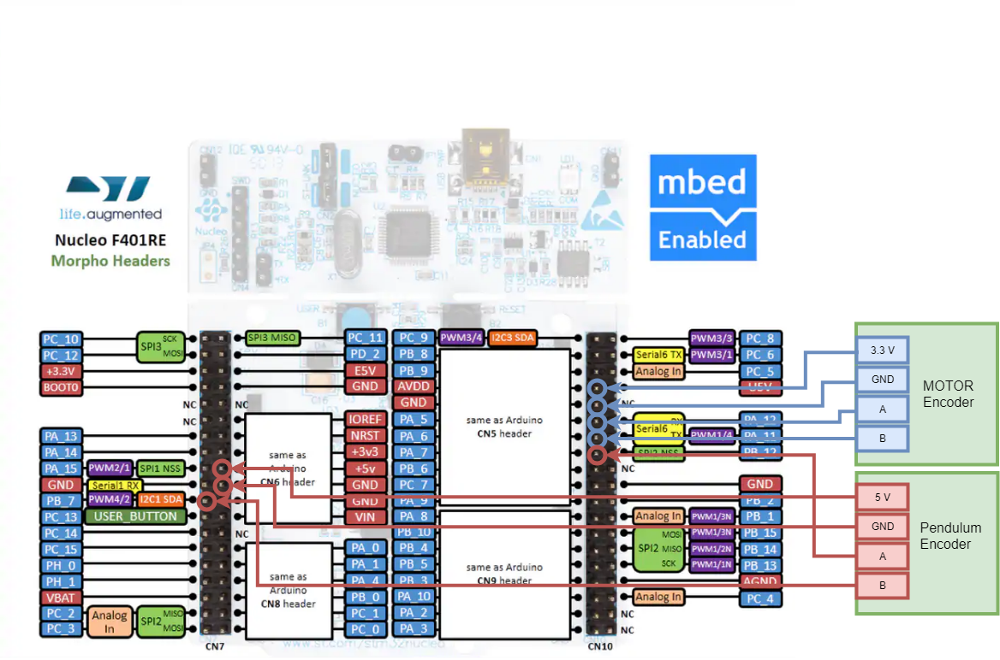

# Inertia Wheel Inverted Pendulum Project 

This project is suitable for anyone with extra free time and passion for interesing projects, but especially for electrical engineering studets (contorl theory students) to learn the control approach of an unstable process and test their algorithms, the primary contorller used in this project is LQR.  

This project is also available on [Thingiverse](https://www.thingiverse.com/thing:3422949)

This project is based on Nucleo STM32F411RE microcontroller. And the repo contains :
- CubeMX project 
- Keil project
- Solidworks files and STLs

The video of it working can be seen on [Link](https://photos.app.goo.gl/Q3Gbn8rL3XPMuehf8):
 

# Electronics hardware
- Nuceleo STM32F411RE - [Mouser](https://hr.mouser.com/ProductDetail/STMicroelectronics/NUCLEO-F411RE?qs=%2fha2pyFaduj0LE%252bzmDN2WGOyc9ZJn6rAAaZxUZnl1jWj%2fTN4JYE9Mw%3d%3d) 
- Monster motor shield - [Ebay](https://www.ebay.com/itm/L298N-Dual-VNH2SP30-Stepper-Motor-Driver-Module-30A-Monster-Moto-Shield-Replace/112031018900?hash=item1a1591af94:g:R4YAAOSwEaBaTafh)
- Motor - Mabuchi RS-385PH with encoder (hall or optical)
  -  With encoder or hall sensors  [Ebay](https://www.ebay.com/itm/RS-385PH-16140-MABUCHI-DC-24V-Motor-for-Printer-Copy-machine/222827327725?epid=24014452613&hash=item33e18b30ed:g:ulEAAOSwZFdaecSZ:rk:8:pf:0)
  -  I used motor without sensor and retrofited it with Hall encoder 20cpr [Ebay](https://www.ebay.com/itm/Pololu-Romi-Encoder-Pair-Kit-12-CPR-3-5-18V-with-Hall-effect-sensor-3542/272789024914?epid=2157895482&hash=item3f837e3092:g:MxkAAOSwu9Jb3CQt:rk:1:pf:1&frcectupt=true)
- Encoder [Aliexpress](https://www.aliexpress.com/item/360-600P-R-Photoelectric-Incremental-Rotary-Encoder-5-24V-AB-Two-Phases-Shaft/32756209569.html?spm=2114.search0104.3.38.1c0b9456Bf5oQP&ws_ab_test=searchweb0_0,searchweb201602_1_10065_10068_319_10059_10884_317_10887_10696_321_322_453_10084_454_10083_10103_10618_10307_10820_10301_10821_10303_537_536_10902,searchweb201603_45,ppcSwitch_0&algo_expid=3179dab4-6711-42f4-8e94-b644142c4211-5&algo_pvid=3179dab4-6711-42f4-8e94-b644142c4211)
- 1x 8mm steel or aluminum rod, 300mm long 
- 1x M10x1.5 screw 
- 2x M10x1.5 nuts
- 10x M3 screw 
- 10x M3 Brass Knurl Nuts [Aliexpress](https://www.aliexpress.com/item/100pcs-Brass-Knurl-Nuts-M3x4mm-L-5mm-OD-Metric-Threaded-insert/1294839803.html?spm=a2g0s.9042311.0.0.1a544c4dO3MjB8)
- 2x ball bearing, 8mm x 26mm x 6mm 
- steel/amulinum/wooden plate (cca 90mm x 2mm x300mm)

# 3D printed parts
-  Inetria wheel 
   - Motor shaft mount has to be adapted
   - The two provided wheel STLs are for 14tooth and 12tooth version of motors
   - Feel free to make your own version of the inertia wheel with the solidworks file
-  Motor mount
-  Pole shaft connector
-  Shaft adapter
-  Table mount + bearing holder
-  Nucleo mount

# Control algorithm
 - PD (Simple)
 - LQR algorithm (Intermediate) - <b>Included in the software + Synthesis using Matlab scirpt</b>
 - MPC (Advanced) - Suggested use of [muao MPC](http://ifatwww.et.uni-magdeburg.de/syst/muAO-MPC/)

# Connecting the hardware
 - Monster motor shield is mounted on nucleo very simply, as on any Arduino
    - It provides the hardware connections needed and no need for additional jumpers
    - Inertia wheel motor should be connected to motor 2 terminal
    - 18V - 5A power supply should be used to power the shield
 - Encoder connection diagram is as follows:
 

# Running the code
 - Build the Keil project and download it to your Nucleo